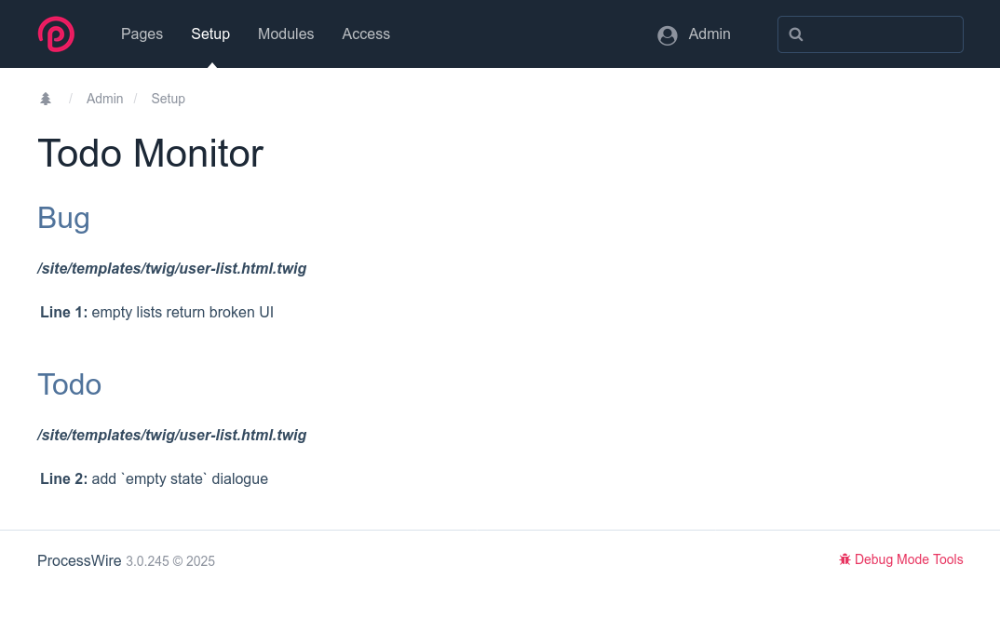

# ProcessTodoMonitor Module

ProcessTodoMonitor is a module for ProcessWire CMS that scans your template files for TODO comments and displays them in the admin interface. This helps developers keep track of tasks and notes directly from their codebase.

## Features

- Scans template files for TODO comments.
- Displays grouped TODO items by tag in the admin interface.
- Supports custom file extensions and keywords.

## Installation

1. Download or clone this repository into your ProcessWire `site/modules` directory.
2. In the ProcessWire admin, go to Modules > Refresh.
3. Find 'TodoMonitor' in the list and click 'Install'.

## Configuration

- Configure file extensions and keywords in your `site/config.php`:
  ```php
  $config->todoMonitorExtensions = "php,css,js,twig,latte";
  $config->todoMonitorKeywords = 'Bug,Todo,Info';
  ```
- Add comments
  ```twig
  @BUG empty lists return broken UI
  @TODO add`empty state` dialogue
  @INFO added for demo purposes
  ```

## Usage

- The module runs a scan every 5 minutes using LazyCron.
- Access the TODO Monitor page in the admin to view your TODO items.



## License

This project is licensed under the MIT License - see the LICENSE file for details.

## Author

Alexander Abelt

## Links

- [ProcessWire](https://processwire.com)
- [webmanufaktur](https://webmanufaktur.net/)
